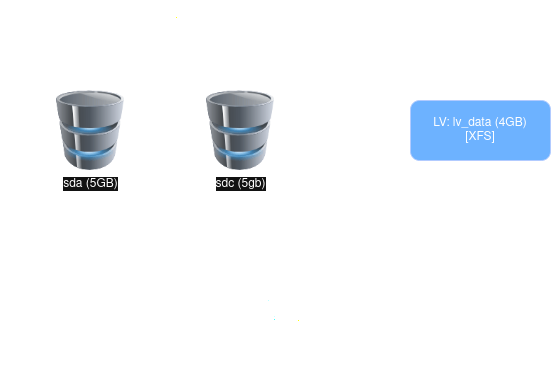
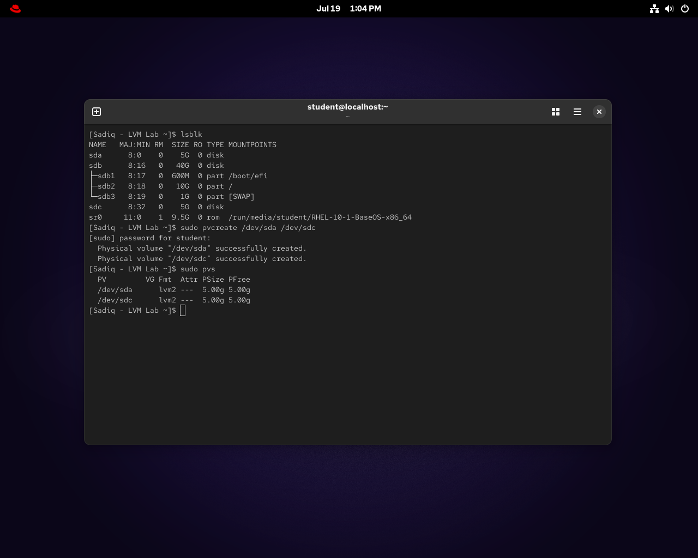
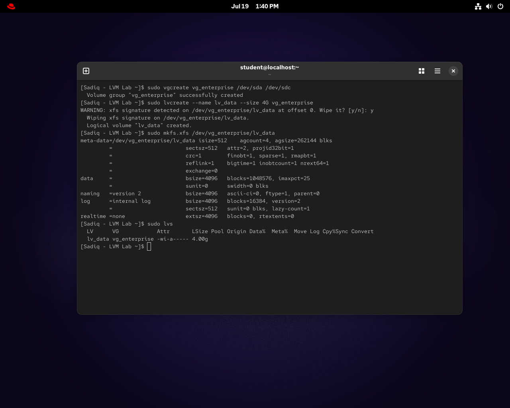
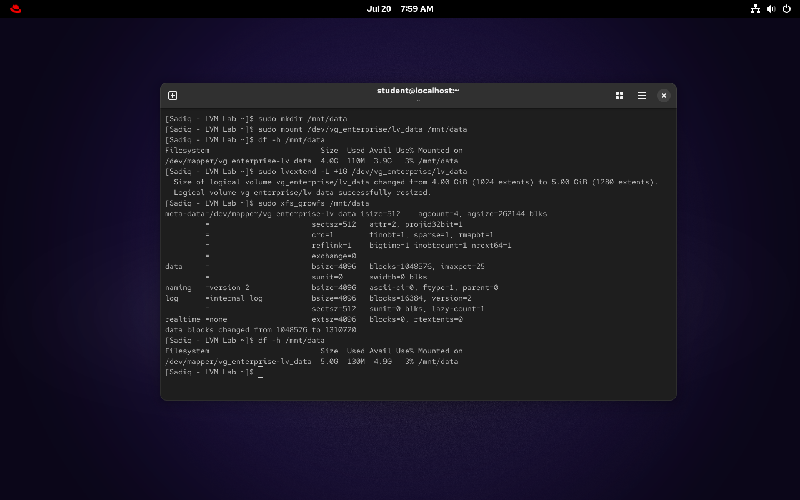

# 🛡️ Project 02: Enterprise Logical Storage Architecture & Live Resizing (RHEL 10)

## 📌 The Big Why
In an enterprise environment, traditional partitioning is rigid and risky to modify on the fly. Logical Volume Manager (LVM) abstracts physical disks into flexible storage pools, allowing administrators to resize, extend, or migrate storage dynamically without unmounting the filesystem. This project demonstrates configuring LVM with the XFS filesystem on Red Hat Enterprise Linux 10 and performing a live disk expansion to accommodate growing data needs with zero downtime.

## 🏗️ Logical Architecture Flow
Below is the diagram illustrating the LVM architecture for this project. Two physical disks (`sda` and `sdc`, 5GB each) are combined to form a storage pool, from which a single Logical Volume (`lv_data`) is carved out and formatted with XFS.

## 🛠️ Core Commands Used
*   `sudo pvcreate` / `pvs` - To initialize empty disks as Physical Volumes and verify their status.
*   `sudo vgcreate` / `sudo lvcreate` - To group the PVs into a Volume Group and allocate a specific size for the Logical Volume.
*   `sudo mkfs.xfs` - To format the newly created Logical Volume with the high-performance XFS filesystem.
*   `sudo lvextend` / `sudo xfs_growfs` - To extend the Logical Volume size and subsequently grow the XFS filesystem online.

## 📸 Verification & Proof of Concept

### 1. Initializing Physical Volumes (PV)

### 2. Setting Up Volume Group (VG) and Logical Volume (LV)

### 3. Mounting & Live Disk Resize

## ⚠️ Troubleshooting Risk & Lessons Learned
**Legacy XFS Signatures:** During the LVM creation phase, the system detected a legacy XFS signature on the disk.
*   **Resolution:** We had to resolve this by deliberately wiping (overwriting) the old signature. This step is crucial to ensure clean filesystem boundaries and prevent potential data corruption or mounting conflicts in the new configuration.
